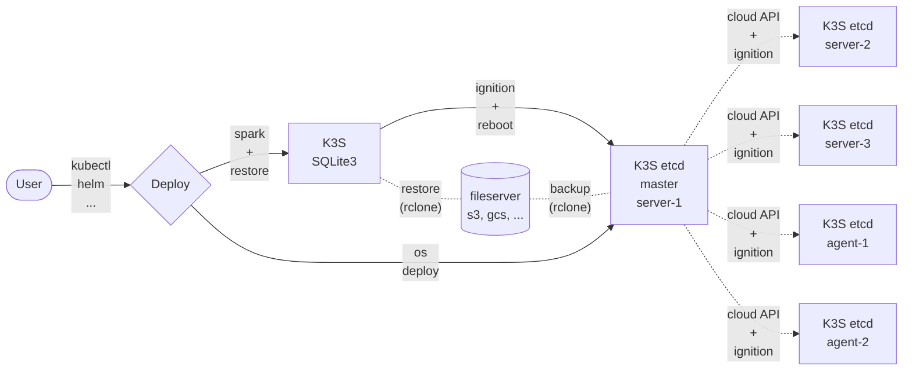

# i12e: infrastructure

**i12e** is an **infrastructure** [numeronym](https://en.wikipedia.org/wiki/Numeronym)

- [Architecture](#architecture)
- [Requirements](#requirements)
  - [helm](#helm)
  - [age](#age)
  - [sops](#sops)
  - [helm-secrets](#helm-secrets)
  - [yq](#yq)
- Modules (not in this page)
  - [os](os/README.md)
  - [dhcpd](dhcpd/README.md)

## Architecture

**Notice**: be aware that this is an over-simplified architectured. Details will be provided as they are defined



Details:

- User can start 2 procedures
  - **(1)** os-deploy to generate k3s-etcd master node
  - **(2)** spark-deploy to generate k3s-sqlite3 node
    - this now will become k3s-etcd using rclone-saved data and self-ignition + reboot
- k3s etcd server node (anyone, but just one)
  - can generate/delete other server nodes
  - can generate/delete other agent nodes
  - must perform regular backups
  - must update tls-san DNS register

## Requirements

### helm

- https://helm.sh/
- https://github.com/helm/helm

```
$ brew install helm
```

### age

- https://age-encryption.org/
- https://github.com/FiloSottile/age

```
# apt install age
```

### sops

- https://getsops.io/
- https://github.com/getsops/sops

```
$ brew install sops
```

### helm-secrets

[https://github.com/jkroepke/helm-secrets](https://github.com/jkroepke/helm-secrets)

```
$ helm plugin list
NAME    VERSION TYPE    APIVERSION      PROVENANCE      SOURCE
(... nothing ...)

$ helm plugin install --verify=false https://github.com/jkroepke/helm-secrets
WARNING: Skipping plugin signature verification
Installed plugin: secrets

$ helm plugin list
NAME    VERSION         TYPE            APIVERSION      PROVENANCE      SOURCE
secrets 4.8.0-dev       getter/v1       legacy          unknown         unknown
```

### yq

- https://mikefarah.gitbook.io/yq/
- https://github.com/kislyuk/yq
```
# apt install yq
```
