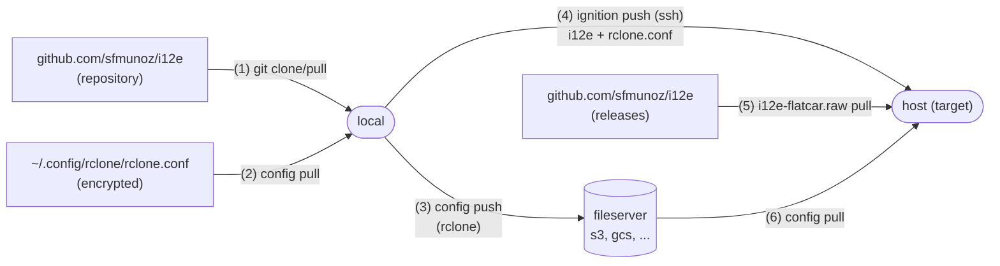

# i12e: infrastructure

**i12e** is an **infrastructure** [numeronym](https://en.wikipedia.org/wiki/Numeronym)

- [Guidelines](#guidelines)
- [Architecture](#architecture)
- [Requirements](#requirements)
  - [helm](#helm)
  - [age](#age)
  - [sops](#sops)
  - [helm-secrets](#helm-secrets)
  - [yq](#yq)
- [Genesis](#genesis)
- Modules (not in this page)
  - [os](os/README.md)
  - [dhcpd](dhcpd/README.md)

## Guidelines

Simple outline:

- [KISS](https://en.wikipedia.org/wiki/KISS_principle)
- Flexible
- Full control
- Cluster API inspired but...
  - Opinionated
  - Smaller
  - Flatcar OS
  - k3s for k8s
- Volatile: always pulls recent data from stable storage
- rclone is the tool to push-to/pull-from storage
- Nomad: easily move from one cloud provider to another
- backup-centric: it's the pillar of the system

## Architecture

**Notice**: be aware that this is an over-simplified architecture. Details will be provided as they are defined


```mermaid
flowchart LR
    github_repo["github.com/sfmunoz/i12e<br/>(repository)"]
    github_rel["github.com/sfmunoz/i12e<br/>(releases)"]
    rclone_conf["~/.config/rclone/rclone.conf<br/>(encrypted)"]
    local(["local"])
    fs[("fileserver<br/>s3, gcs, ...")] 
    host(["host (target)"])
    github_repo -->|"(1) git clone/pull"| local
    rclone_conf -->|"(2) config pull"| local
    local -->|"(3) config push<br/>(rclone)"| fs
    local -->|"(4) ignition push (ssh)<br/>i12e + rclone.conf"| host
    github_rel -->|"(5) i12e-flatcar.raw pull"| host
    fs -->|"(6) config pull"| host
```

Details:

- **(1)** Code is pulled from **github.com/sfmunoz/i12e**
- **(2)** Rclone config is read from **~/.config/rclone/rclone.conf** (encrypted)
- **(3)** Configuration is pushed to rclone-compatible storage
- **(4)** Ignition configuration is pushed to target host (**rclone.conf** included)
- **(5)** **i12e-flatcar.raw** is pulled from github
- **(6)** Target host pulls whatever is required from rclone-compatible storage

## Requirements

### helm

- https://helm.sh/
- https://github.com/helm/helm

```
$ brew install helm
```

### age

- https://age-encryption.org/
- https://github.com/FiloSottile/age

```
# apt install age
```

### sops

- https://getsops.io/
- https://github.com/getsops/sops

```
$ brew install sops
```

### helm-secrets

[https://github.com/jkroepke/helm-secrets](https://github.com/jkroepke/helm-secrets)

```
$ helm plugin list
NAME    VERSION TYPE    APIVERSION      PROVENANCE      SOURCE
(... nothing ...)

$ helm plugin install --verify=false https://github.com/jkroepke/helm-secrets
WARNING: Skipping plugin signature verification
Installed plugin: secrets

$ helm plugin list
NAME    VERSION         TYPE            APIVERSION      PROVENANCE      SOURCE
secrets 4.8.0-dev       getter/v1       legacy          unknown         unknown
```

### yq

- https://mikefarah.gitbook.io/yq/
- https://github.com/kislyuk/yq
```
# apt install yq
```

## Genesis

Help:
```
$ ./genesis/run.sh
usage: python3 -m genesis [-h] [-d] {artifact,butane,python3,sh} ...

genesis

options:
  -h, --help            show this help message and exit
  -d, --debug           enable debug mode

genesis command:
  choose one genesis command

  {artifact,butane,python3,sh}
                        genesis command to be run
    artifact            generate artifact and push it using rclone
    butane              run butane to generate ignition code
    python3             run python3 within the container
    sh                  run sh within the container

46285520+sfmunoz@users.noreply.github.com (C) 2026
```
Artifact generation:
```
$ ./genesis/run.sh artifact
2026-01-07 19:51:19,292 [    103] [I] ==== genesis artifact begin ==== (artifact:166)
2026-01-07 19:51:19,293 [    104] [I] 'etc/extensions/containerd-flatcar.raw' added (artifact:46)
2026-01-07 19:51:19,293 [    104] [I] 'etc/extensions/docker-flatcar.raw' added (artifact:46)
2026-01-07 19:51:19,294 [    104] [I] 'etc/flatcar/update.conf' added (artifact:54)
2026-01-07 19:51:19,294 [    104] [I] 'etc/rancher/k3s/config.yaml' added (artifact:74)
2026-01-07 19:51:19,294 [    105] [I] 'etc/systemd/system/k3s.service.d/override.conf' added (artifact:87)
2026-01-07 19:51:19,294 [    105] [I] 'etc/systemd/system.conf.d/genesis.conf' added (artifact:100)
2026-01-07 19:51:19,294 [    105] [I] 'etc/crictl.yaml' added (artifact:108)
2026-01-07 19:51:19,294 [    105] [I] 'opt/bin/e' added (artifact:117)
2026-01-07 19:51:19,295 [    105] [I] 'etc/i12e/z.flag' added (artifact:129)
2026-01-07 19:51:19,362 [    173] [I] $ rclone rcat rem:artifact.tar.gz (artifact:138)
2026/01/07 19:51:20 NOTICE: Encrypted drive 'rem:': --checksum is in use but the source and destination have no hashes in common; falling back to --size-only
2026-01-07 19:51:20,102 [    913] [I] $ rclone cat rem:artifact.tar.gz (artifact:145)
2026-01-07 19:51:20,464 [   1275] [I] sha256(bef): c2ce078cb5c79cd366fea321fc47f8ba0171fe9c8f0d924bfae692c7c3e1f809 (artifact:153)
2026-01-07 19:51:20,464 [   1275] [I] sha256(aft): c2ce078cb5c79cd366fea321fc47f8ba0171fe9c8f0d924bfae692c7c3e1f809 (artifact:154)
2026-01-07 19:51:20,464 [   1275] [I] $ tar tvz (artifact:159)
lrwxrwxrwx root/root         0 2026-01-07 19:51:19 etc/extensions/containerd-flatcar.raw -> /dev/null
lrwxrwxrwx root/root         0 2026-01-07 19:51:19 etc/extensions/docker-flatcar.raw -> /dev/null
-rw-r--r-- root/root        73 2026-01-07 19:51:19 etc/flatcar/update.conf
-rw------- root/root       240 2026-01-07 19:51:19 etc/rancher/k3s/config.yaml
drwxr-xr-x root/root         0 2026-01-07 19:51:19 etc/systemd/system/k3s.service.d/
-rw-r--r-- root/root       129 2026-01-07 19:51:19 etc/systemd/system/k3s.service.d/override.conf
drwxr-xr-x root/root         0 2026-01-07 19:51:19 etc/systemd/system.conf.d/
-rw-r--r-- root/root        68 2026-01-07 19:51:19 etc/systemd/system.conf.d/genesis.conf
-rw-r--r-- root/root       145 2026-01-07 19:51:19 etc/crictl.yaml
-rwxr-xr-x root/root       178 2026-01-07 19:51:19 opt/bin/e
drwx------ root/root         0 2026-01-07 19:51:19 etc/i12e/
-rw------- root/root         0 2026-01-07 19:51:19 etc/i12e/z.flag
2026-01-07 19:51:20,466 [   1277] [I] ---- genesis artifact end ---- (artifact:178)
```
Butane generation:
```
$ ./genesis/run.sh butane
base64 -d <<< "H4sIA...(quite long base64 encoded gzipped script)...oIAAA=" | gunzip | bash
```
Butane injection (over ssh):
```
$ ./genesis/run.sh butane | ssh core@192.168.56.51 bash
+ sudo rm -fv /oem/config.ign
removed '/oem/config.ign'
+ base64 -d
+ gunzip
+ sudo flatcar-reset --keep-machine-id --keep-paths '/etc/ssh/ssh_host_.*' /var/log /var/lib/rancher/k3s/agent/containerd -F /dev/stdin
WARNING: Running without --backup can cause data loss if the keep paths don't work as expected.
Also check whether your regex works as wanted with --preview-delete and --preview-keep.

Wrote machine ID as kernel cmdline parameter to /oem/grub.cfg
Removed any ignition.config.url kernel cmdline parameter in /oem/grub.cfg
Wrote Ignition file /oem/config.ign
Prepared /selective-os-reset and /boot/flatcar/first_boot
Staged OS reset, you can reboot now
+ sudo test -s /oem/config.ign
+ sudo jq . /oem/config.ign
{
  "ignition": {
    "version": "3.3.0"
  },
  (... ignition config ...)
}
+ sudo systemd-run bash -c 'sleep 1 ; systemctl reboot'
Running as unit: run-rb96ef8572bb2485e9ba0e96db33005c0.service; invocation ID: 314d5d8b3f144e8a923ff6ba0ba8b353
```
Python3 execution:
```
$ ./genesis/run.sh python3
Python 3.14.2 (main, Dec 18 2025, 00:40:52) [GCC 15.2.0] on linux
Type "help", "copyright", "credits" or "license" for more information.
>>>
```
sh execution:
```
$ ./genesis/run.sh sh
/ #
```
