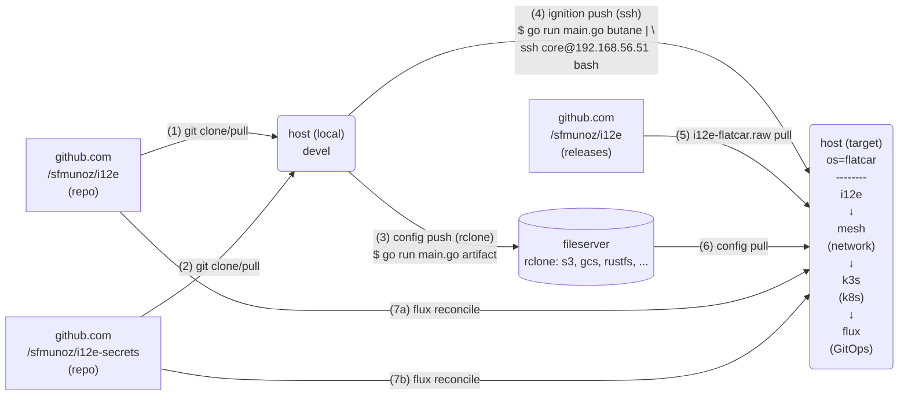

# i12e: infrastructure

**i12e** is an **infrastructure** [numeronym](https://en.wikipedia.org/wiki/Numeronym)

## Architecture

Simplified architecture diagram:


```mermaid
flowchart LR
    i12e_repo["github.com<br/>/sfmunoz/i12e<br/>(repo)"]
    i12e_secrets_repo["github.com<br/>/sfmunoz/i12e-secrets<br/>(repo)"]
    i12e_rel["github.com<br/>/sfmunoz/i12e<br/>(releases)"]
    local("host (local)\ndevel")
    fs[("fileserver<br/>rclone: s3, gcs, rustfs, ...")] 
    host("host (target)\nos=flatcar\n--------\ni12e\n↓\nmesh\n(network)\n↓\nk3s\n(k8s)\n↓\nflux\n(GitOps)")
    i12e_repo -->|"(1) git clone/pull"| local
    i12e_secrets_repo -->|"(2) git clone/pull"| local
    local -->|"(3) config push (rclone)<br/>$ go run main.go artifact"| fs
    local -->|"(4) ignition push (ssh)<br/>$ go run main.go butane | \<br/>ssh core@192.168.56.51 bash"| host
    i12e_rel -->|"(5) i12e-flatcar.raw pull"| host
    fs -->|"(6) config pull"| host
    i12e_repo -->|"(7a) flux reconcile"| host
    i12e_secrets_repo -->|"(7b) flux reconcile"| host
```

Details:

- **(1)** Code is pulled from **github.com/sfmunoz/i12e**
- **(2)** Secrets are pulled from **github.com/sfmunoz/i12e-secrets**
- **(3)** Configuration is pushed to rclone-compatible storage using `go run main.go artifact`
- **(4)** Ignition configuration is injected to target host using `go run main.go butane | ssh core@192.168.56.51 bash` (**rclone.conf** is included)
- **(5)** **i12e-flatcar.raw** is pulled from github releases
- **(6)** Target host pulls whatever is required from rclone-compatible storage
- **(7a)+(7b)** **flux** is in charge of git-based reconciliation

## Guidelines

Simple outline:

- [KISS](https://en.wikipedia.org/wiki/KISS_principle)
- Flexible
- Full control
- Cluster API inspired but...
  - Opinionated
  - Smaller
  - Flatcar OS
  - k3s for k8s
- Volatile: always pulls recent data from stable storage
- Nomad: easily move from one cloud provider to another
- **rclone** is the tool to push-to/pull-from storage
- backup-centric:
  - it's the pillar of the system
  - **restic** is the tool to manage it

## I12E Artifact

Help:

```
$ go run main.go artifact -h
Artifact management:

  - generation: tar+gz artifact
  - push to remote using rclone

Usage:
  i12e artifact [flags]

Flags:
  -h, --help   help for artifact
  -p, --prod   Environment: 'prod' if set (default: 'dev')
```

Generation:

```
$ go run main.go artifact
2026-09-07T13:55:14.527Z 0d00h00m02.159s [I] rclonePush() remFile=rem:artifact.tar.gz
2026-09-07T13:55:15.800Z 0d00h00m03.432s [I] sha256(bef) sha256=9e1d616d182b2f16c3bef29363eaf9900efac86b158ff80b8213a8ce6188a4bd
2026-09-07T13:55:15.800Z 0d00h00m03.433s [I] sha256(aft) sha256=9e1d616d182b2f16c3bef29363eaf9900efac86b158ff80b8213a8ce6188a4bd
2026-09-07T13:55:15.806Z 0d00h00m03.439s [I] > tgz=drwx------ root/root         0 2026-09-07 13:55 etc/i12e
2026-09-07T13:55:15.807Z 0d00h00m03.439s [I] > tgz=drwx------ root/root         0 2026-09-07 13:55 etc/i12e/flags
2026-09-07T13:55:15.807Z 0d00h00m03.439s [I] > tgz=drwx------ root/root         0 2026-09-07 13:55 etc/i12e/k3s
2026-09-07T13:55:15.807Z 0d00h00m03.439s [I] > tgz=drwx------ root/root         0 2026-09-07 13:55 etc/i12e/flux
2026-09-07T13:55:15.807Z 0d00h00m03.439s [I] > tgz=drwxr-xr-x root/root         0 2026-09-07 13:55 etc/systemd/system.conf.d
2026-09-07T13:55:15.807Z 0d00h00m03.439s [I] > tgz=drwx------ root/root         0 2026-09-07 13:55 etc/wireguard
2026-09-07T13:55:15.807Z 0d00h00m03.439s [I] > tgz=drwxr-xr-x root/root         0 2026-09-07 13:55 opt/libexec
2026-09-07T13:55:15.807Z 0d00h00m03.439s [I] > tgz=drwxr-xr-x root/root         0 2026-09-07 13:55 opt/libexec/i12e
2026-09-07T13:55:15.807Z 0d00h00m03.439s [I] > tgz=drwxr-xr-x root/root         0 2026-09-07 13:55 opt/libexec/i12e/plugins
2026-09-07T13:55:15.807Z 0d00h00m03.439s [I] > tgz=-rw-r--r-- root/root       145 2026-09-07 13:55 etc/crictl.yaml
2026-09-07T13:55:15.807Z 0d00h00m03.439s [I] > tgz=-rw-r--r-- root/root        73 2026-09-07 13:55 etc/flatcar/update.conf
2026-09-07T13:55:15.807Z 0d00h00m03.439s [I] > tgz=-rw------- root/root         7 2026-09-07 13:55 etc/i12e/iface.txt
2026-09-07T13:55:15.807Z 0d00h00m03.439s [I] > tgz=-rw------- root/root       223 2026-09-07 13:55 etc/i12e/k3s/config-main.yaml
2026-09-07T13:55:15.807Z 0d00h00m03.439s [I] > tgz=-rw------- root/root       233 2026-09-07 13:55 etc/i12e/k3s/config-server.yaml
2026-09-07T13:55:15.807Z 0d00h00m03.439s [I] > tgz=-rw------- root/root        75 2026-09-07 13:55 etc/i12e/k3s/config-agent.yaml
2026-09-07T13:55:15.807Z 0d00h00m03.439s [I] > tgz=-rw-r--r-- root/root       129 2026-09-07 13:55 etc/i12e/k3s/override-main.conf
2026-09-07T13:55:15.807Z 0d00h00m03.439s [I] > tgz=-rw-r--r-- root/root       129 2026-09-07 13:55 etc/i12e/k3s/override-server.conf
2026-09-07T13:55:15.807Z 0d00h00m03.439s [I] > tgz=-rw-r--r-- root/root       128 2026-09-07 13:55 etc/i12e/k3s/override-agent.conf
2026-09-07T13:55:15.807Z 0d00h00m03.439s [I] > tgz=-rw------- root/root       208 2026-09-07 13:55 etc/i12e/flux/flux.cfg
2026-09-07T13:55:15.807Z 0d00h00m03.439s [I] > tgz=-rw------- root/root      2031 2026-09-07 13:55 etc/nftables.conf
2026-09-07T13:55:15.807Z 0d00h00m03.439s [I] > tgz=-rw-r--r-- root/root        68 2026-09-07 13:55 etc/systemd/system.conf.d/i12e.conf
2026-09-07T13:55:15.807Z 0d00h00m03.439s [I] > tgz=-rw-r--r-- root/root       304 2026-09-07 13:55 etc/systemd/system/nftables.service
2026-09-07T13:55:15.807Z 0d00h00m03.439s [I] > tgz=-rw------- root/root      1804 2026-09-07 13:55 etc/wireguard/wg0.conf
2026-09-07T13:55:15.807Z 0d00h00m03.439s [I] > tgz=-rwxr-xr-x root/root       178 2026-09-07 13:55 opt/bin/e
2026-09-07T13:55:15.807Z 0d00h00m03.439s [I] > tgz=-rwxr-xr-x root/root       950 2026-09-07 13:55 opt/libexec/i12e/artifact-tune.sh
2026-09-07T13:55:15.807Z 0d00h00m03.439s [I] > tgz=-rw-r--r-- root/root      1028 2026-09-07 13:55 opt/libexec/i12e/plugins/00-purge.sh
2026-09-07T13:55:15.807Z 0d00h00m03.439s [I] > tgz=-rw-r--r-- root/root      1443 2026-09-07 13:55 opt/libexec/i12e/plugins/10-k3s.sh
2026-09-07T13:55:15.807Z 0d00h00m03.439s [I] > tgz=-rw-r--r-- root/root      2360 2026-09-07 13:55 opt/libexec/i12e/plugins/35-flux.sh
2026-09-07T13:55:15.807Z 0d00h00m03.439s [I] > tgz=-rw------- root/root         0 2026-09-07 13:55 etc/i12e/flags/artifact-pulled
2026-09-07T13:55:15.807Z 0d00h00m03.440s [I] > tgz=
```

## I12E Butane

Help:

```
$ go run main.go butane -h
Run butane to generate ignition code

Examples:
  Reset flatcar host over ssh (default: '-o bash_b64'):
    $ i12e butane | ssh core@192.168.56.51 bash

  Generate ignition file:
    $ i12e butane -o ignition

Usage:
  i12e butane [flags]

Flags:
  -h, --help             help for butane
  -m, --mode string      Set target mode: ["main" "server" "agent"] (default "main")
  -o, --output string    Set output format: ["bash_b64" "bash_raw" "ignition" "debug"] (default "bash_b64")
  -p, --prod             Environment: 'prod' if set (default: 'dev')
  -v, --version string   Set version to deploy (default "latest")
```

Generation:

```
$ go run main.go butane
base64 -d <<< "H4sIA...(quite long base64 encoded gzipped script)...oIAAA=" | gunzip | bash
```

Injection over ssh:

```
$ go run main.go butane | ssh core@192.168.56.51 bash
+ sudo rm -fv /oem/config.ign
removed '/oem/config.ign'
+ base64 -d
+ gunzip
+ sudo flatcar-reset --keep-machine-id --keep-paths '/etc/ssh/ssh_host_.*' /var/log /var/lib/rancher/k3s/agent/containerd -F /dev/stdin
WARNING: Running without --backup can cause data loss if the keep paths don't work as expected.
Also check whether your regex works as wanted with --preview-delete and --preview-keep.

Wrote machine ID as kernel cmdline parameter to /oem/grub.cfg
Removed any ignition.config.url kernel cmdline parameter in /oem/grub.cfg
Wrote Ignition file /oem/config.ign
Prepared /selective-os-reset and /boot/flatcar/first_boot
Staged OS reset, you can reboot now
+ sudo test -s /oem/config.ign
+ sudo jq . /oem/config.ign
{
  "ignition": {
    "version": "3.3.0"
  },
  (... ignition config ...)
}
+ sudo systemd-run bash -c 'sleep 1 ; systemctl reboot'
Running as unit: run-rb96ef8572bb2485e9ba0e96db33005c0.service; invocation ID: 314d5d8b3f144e8a923ff6ba0ba8b353
```

## Flux

### Repository structure reference

- https://fluxcd.io/flux/guides/repository-structure/#monorepo
  - https://github.com/fluxcd/flux2-kustomize-helm-example

### Added `--components-extra=source-watcher`

- Ref: https://github.com/fluxcd/source-watcher
- Plugin change: https://github.com/sfmunoz/i12e/commit/acb1f88e22aa6dcd40a8f412e836a19b85b9d254
- Applied by **flux** on `go run main.go butane | ssh core@192.168.56.51 bash` execution:
  - https://github.com/sfmunoz/i12e/commit/a87ccc7cc3c6d36d70f41a50cce5355abb0f319e

### dev-k3s cluster bootstrap

```
$ export GITHUB_TOKEN="github_pat_..."

$ ./scripts/flux-bootstrap.sh dev
+ flux bootstrap github --token-auth --owner=sfmunoz --repository=i12e --path=clusters/dev --branch=main --private=false --personal=true --author-name flux-dev-bot --author-email 46285520+sfmunoz@users.noreply.github.com
► connecting to github.com
► cloning branch "main" from Git repository "https://github.com/sfmunoz/i12e.git"
✔ cloned repository
► generating component manifests
✔ generated component manifests
✔ committed component manifests to "main" ("7fdd758720510de70d0ea4d0442ba17deb71e9fe")
► pushing component manifests to "https://github.com/sfmunoz/i12e.git"
► installing components in "flux-system" namespace
✔ installed components
✔ reconciled components
► determining if source secret "flux-system/flux-system" exists
► generating source secret
► applying source secret "flux-system/flux-system"
✔ reconciled source secret
► generating sync manifests
✔ generated sync manifests
✔ committed sync manifests to "main" ("fc1f7754e57c6c4500caeb94cfd0447f47b8836b")
► pushing sync manifests to "https://github.com/sfmunoz/i12e.git"
► applying sync manifests
✔ reconciled sync configuration
◎ waiting for GitRepository "flux-system/flux-system" to be reconciled
✔ GitRepository reconciled successfully
◎ waiting for Kustomization "flux-system/flux-system" to be reconciled
✔ Kustomization reconciled successfully
► confirming components are healthy
✔ helm-controller: deployment ready
✔ kustomize-controller: deployment ready
✔ notification-controller: deployment ready
✔ source-controller: deployment ready
✔ all components are healthy
```

### prod-k3s cluster bootstrap

```
$ export GITHUB_TOKEN="github_pat_..."

$ ./scripts/flux-bootstrap.sh prod
+ flux bootstrap github --token-auth --owner=sfmunoz --repository=i12e --path=clusters/prod --branch=main --private=false --personal=true --author-name flux-prod-bot --author-email 46285520+sfmunoz@users.noreply.github.com
► connecting to github.com
► cloning branch "main" from Git repository "https://github.com/sfmunoz/i12e.git"
✔ cloned repository
► generating component manifests
✔ generated component manifests
✔ committed component manifests to "main" ("653812519d8bae0a33f2ee8d6cfec9ad613cb741")
► pushing component manifests to "https://github.com/sfmunoz/i12e.git"
► installing components in "flux-system" namespace
✔ installed components
✔ reconciled components
► determining if source secret "flux-system/flux-system" exists
► generating source secret
► applying source secret "flux-system/flux-system"
✔ reconciled source secret
► generating sync manifests
✔ generated sync manifests
✔ committed sync manifests to "main" ("6c5a2e4eb420616debbf2e52973a2b1c0f0380ce")
► pushing sync manifests to "https://github.com/sfmunoz/i12e.git"
► applying sync manifests
✔ reconciled sync configuration
◎ waiting for GitRepository "flux-system/flux-system" to be reconciled
✔ GitRepository reconciled successfully
◎ waiting for Kustomization "flux-system/flux-system" to be reconciled
✔ Kustomization reconciled successfully
► confirming components are healthy
✔ helm-controller: deployment ready
✔ kustomize-controller: deployment ready
✔ notification-controller: deployment ready
✔ source-controller: deployment ready
✔ all components are healthy
```

### dev-talos cluster bootstrap

```
$ export GITHUB_TOKEN='github_pat_...'

$ ./scripts/flux-bootstrap.sh dev talos
+ flux bootstrap github --token-auth --owner=sfmunoz --repository=i12e --path=clusters/dev/talos --branch=main --private=false --personal=true --author-name flux-dev-talos-bot --author-email 46285520+sfmunoz@users.noreply.github.com --components-extra=source-watcher
► connecting to github.com
► cloning branch "main" from Git repository "https://github.com/sfmunoz/i12e.git"
✔ cloned repository
► generating component manifests
✔ generated component manifests
✔ committed component manifests to "main" ("4196dce8cb3626076e8dfbf847f5ca7b36d58cf0")
► pushing component manifests to "https://github.com/sfmunoz/i12e.git"
► installing components in "flux-system" namespace
✔ installed components
✔ reconciled components
► determining if source secret "flux-system/flux-system" exists
► generating source secret
► applying source secret "flux-system/flux-system"
✔ reconciled source secret
► generating sync manifests
✔ generated sync manifests
✔ committed sync manifests to "main" ("e013e7e7a12e9bc8bda595ac109537707c1b9410")
► pushing sync manifests to "https://github.com/sfmunoz/i12e.git"
► applying sync manifests
✔ reconciled sync configuration
◎ waiting for GitRepository "flux-system/flux-system" to be reconciled
✔ GitRepository reconciled successfully
◎ waiting for Kustomization "flux-system/flux-system" to be reconciled
✔ Kustomization reconciled successfully
► confirming components are healthy
✔ helm-controller: deployment ready
✔ kustomize-controller: deployment ready
✔ notification-controller: deployment ready
✔ source-controller: deployment ready
✔ source-watcher: deployment ready
✔ all components are healthy
```

## Tools

### butane

- https://coreos.github.io/butane/
- https://github.com/coreos/butane

```
$ brew install butane
```

### age

- https://age-encryption.org/
- https://github.com/FiloSottile/age

```
# apt install age
```

### sops

- https://getsops.io/
- https://github.com/getsops/sops

```
$ brew install sops
```

### helm

- https://helm.sh/
- https://github.com/helm/helm

```
$ brew install helm
```

### helm-secrets

[https://github.com/jkroepke/helm-secrets](https://github.com/jkroepke/helm-secrets)

```
$ helm plugin list
NAME    VERSION TYPE    APIVERSION      PROVENANCE      SOURCE
(... nothing ...)

$ helm plugin install --verify=false https://github.com/jkroepke/helm-secrets
WARNING: Skipping plugin signature verification
Installed plugin: secrets

$ helm plugin list
NAME    VERSION         TYPE            APIVERSION      PROVENANCE      SOURCE
secrets 4.8.0-dev       getter/v1       legacy          unknown         unknown
```

Update (last version):

```
$ helm plugin update secrets
```

## Deleted references

- [os: helm chart deleted](https://github.com/sfmunoz/i12e/commit/0b7c418e016362d8a9817821fdd178612940f38c) → https://github.com/sfmunoz/i12e/issues/296
  - https://kube-vip.io/ install
  - https://prometheus.io/ install
- [fake: helm chart deleted ](https://github.com/sfmunoz/i12e/commit/68bb822a8d44ab22b8e5cdaa40405fec258892dc) → https://github.com/sfmunoz/i12e/issues/297
  - k8s-bulk used
  - Python HTTP client
  - Python HTTP server
